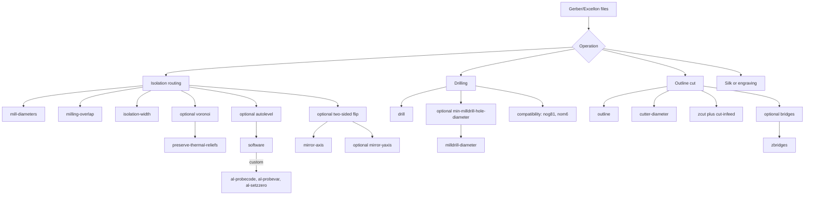

# pcb2gcode command-line options and practical usage

## Executive summary

`pcb2gcode` is best understood as a mature but documentation-fragmented tool: the authoritative option surface comes from the current generated man page in the GitHub repository, the option-specific GitHub wiki pages explain intent and practical behavior better than the terse man page, and the older GitHub/SourceForge manuals are still useful for legacy names and removed options. That matters because some options have changed names, some are deprecated but still appear in old examples, and some newer behaviors are only obvious from issue threads and release history. As of May 2026, the project is still actively released, so old distro packages are especially likely to differ from current upstream behavior. ([current man page](https://raw.githubusercontent.com/pcb2gcode/pcb2gcode/master/man/pcb2gcode.1); [releases](https://github.com/pcb2gcode/pcb2gcode/releases); [obsolete manual notice](https://github.com/pcb2gcode/pcb2gcode/wiki/Manual); [SourceForge manual](https://sourceforge.net/p/pcb2gcode/wiki/Manual/))

The safest modern mental model is this: use a `millproject` file for stable job settings, use the current man page as the canonical list of supported switches, prefer `--mill-diameters` plus `--milling-overlap` plus `--isolation-width` for isolation routing, use `--nog81` on controllers that do not support canned drilling cycles, and treat mirroring, tabs, and autolevelling as areas where the wiki and issue tracker are more informative than the one-line option help. The most important documented or community-confirmed gotchas are that `--offset` does not behave like an extra clearance layer on top of `--mill-diameters`, literal `--mill-diameters=0` is unsafe on current builds, `--mirror-absolute=false` should be treated as obsolete even though it still appears in some older examples, and origin handling across separate runs can cause front/back or drill/mill misalignment if you are not deliberate about `--zero-start`, offsets, and outline data. ([Milling wiki](https://github.com/pcb2gcode/pcb2gcode/wiki/Options%3A-Milling); [Alignment wiki](https://github.com/pcb2gcode/pcb2gcode/wiki/Options%3A-Alignment-for-two-sided-PCB-and-offsets); [issue #412](https://github.com/pcb2gcode/pcb2gcode/issues/412); [issue #749](https://github.com/pcb2gcode/pcb2gcode/issues/749); [example millproject](https://raw.githubusercontent.com/pcb2gcode/pcb2gcode/master/millproject_example))

The practical workflow recommendations are straightforward. For beginners: one-sided boards, one isolation bit, explicit `metric=true` and `metricoutput=true`, a nonzero `zsafe`, a conservative spindle dwell, and drilling plus milling generated in one invocation. For advanced users: multi-bit cleanup with `--mill-diameters`, controlled depth-per-pass using `--mill-infeed` or `--cut-infeed`, controller-aware probing with `--software` and `--al-*`, and careful use of `--bridges` for cutouts. Where the current docs are silent or inconsistent, this report marks behavior as **unspecified** and points to issue/forum evidence rather than guessing. ([Generic wiki](https://github.com/pcb2gcode/pcb2gcode/wiki/Options%3A-Generic); [Common wiki](https://github.com/pcb2gcode/pcb2gcode/wiki/Options%3A-Common); [Drilling wiki](https://github.com/pcb2gcode/pcb2gcode/wiki/Options%3A-Drilling); [Outline wiki](https://github.com/pcb2gcode/pcb2gcode/wiki/Options%3A-Outline))

## Source map and version drift

The current generated man page is the most authoritative single list of options, but it is not the most explanatory source. The GitHub wiki pages by topic—Generic, Common, Milling, Drilling, Outline, Alignment, and Optimizations—are better at explaining *why* a switch exists and how it is meant to be combined with others. The GitHub wiki’s older “Manual” page is explicitly marked obsolete, and the older SourceForge manual is useful mainly for legacy options such as `--dpi`, spelling drift such as `--optimize` versus `--optimise`, and early controller-target assumptions such as TurboCNC in autoleveller examples. ([current man page](https://raw.githubusercontent.com/pcb2gcode/pcb2gcode/master/man/pcb2gcode.1); [Generic wiki](https://github.com/pcb2gcode/pcb2gcode/wiki/Options%3A-Generic); [Milling wiki](https://github.com/pcb2gcode/pcb2gcode/wiki/Options%3A-Milling); [Drilling wiki](https://github.com/pcb2gcode/pcb2gcode/wiki/Options%3A-Drilling); [Outline wiki](https://github.com/pcb2gcode/pcb2gcode/wiki/Options%3A-Outline); [Alignment wiki](https://github.com/pcb2gcode/pcb2gcode/wiki/Options%3A-Alignment-for-two-sided-PCB-and-offsets); [Optimizations wiki](https://github.com/pcb2gcode/pcb2gcode/wiki/Options%3A-Optimizations); [obsolete manual notice](https://github.com/pcb2gcode/pcb2gcode/wiki/Manual); [SourceForge manual](https://sourceforge.net/p/pcb2gcode/wiki/Manual/))

Several version drifts are operationally important. The old manuals document `-v, --version`, while the current man page documents `-V, --version`. The old manuals show `--optimize`; the current man page uses `--optimise`. The current man page documents `--tolerance`, `--nog64`, `--backtrack`, `--path-finding-limit`, `--g0-vertical-speed`, `--g0-horizontal-speed`, `--mirror-yaxis`, and `--config`, which are not all present in older docs. Conversely, the old manuals include options such as `--dpi` and `--outline-width` that do not appear in the current man page and should therefore be treated as legacy unless you are knowingly using an old package. ([current man page](https://raw.githubusercontent.com/pcb2gcode/pcb2gcode/master/man/pcb2gcode.1); [SourceForge manual](https://sourceforge.net/p/pcb2gcode/wiki/Manual/))

The comparison table below is the compact “what lives where” index for the rest of this report. When defaults are not stated in the current man page, they are marked as **unspecified** rather than inferred from examples. That distinction matters because the example `millproject` file is a sample job, not proof of a compiled default. ([current man page](https://raw.githubusercontent.com/pcb2gcode/pcb2gcode/master/man/pcb2gcode.1); [example millproject](https://raw.githubusercontent.com/pcb2gcode/pcb2gcode/master/millproject_example))

| Category | Representative options |
|---|---|
| Geometry and isolation | `--voronoi`, `--offset`, `--mill-diameters`, `--milling-overlap`, `--isolation-width`, `--extra-passes`, `--invert-gerbers`, `--draw-gerber-lines`, `--preserve-thermal-reliefs` |
| Tool selection and changes | `--milldrill`, `--milldrill-diameter`, `--min-milldrill-hole-diameter`, `--drills-available`, `--onedrill`, `--nom6`, `--zchange`, `--zchange-absolute`, `--cutter-diameter` |
| Feed, speed, and depth | `--zwork`, `--mill-feed`, `--mill-vertfeed`, `--mill-infeed`, `--mill-speed`, `--zdrill`, `--zmilldrill`, `--drill-feed`, `--drill-speed`, `--zcut`, `--cut-feed`, `--cut-vertfeed`, `--cut-infeed`, `--cut-speed` |
| Output formatting and file naming | `--metricoutput`, `--tolerance`, `--nog64`, `--preamble-text`, `--preamble`, `--postamble`, `--front-output`, `--back-output`, `--drill-output`, `--milldrill-output`, `--outline-output`, `--basename`, `--output-dir`, `--no-export` |
| Drilling and controller compatibility | `--drill`, `--drill-side`, deprecated `--drill-front`, `--nog81`, `--nog91-1`, `--milldrill*`, `--drills-available` |
| Tabs and holding | `--bridges`, `--bridgesnum`, `--zbridges` |
| Offsets, mirroring, tiling | `--x-offset`, `--y-offset`, `--zero-start`, `--mirror-absolute`, `--mirror-axis`, `--mirror-yaxis`, `--tile-x`, `--tile-y` |
| Units and parsing | `--metric`, `--metricoutput`, `--config`, `--noconfigfile`, `--ignore-warnings`, legacy `--dpi`, deprecated `--svg` |
| Path optimization | `--optimise`, `--eulerian-paths`, `--vectorial`, `--tsp-2opt`, `--path-finding-limit`, `--g0-vertical-speed`, `--g0-horizontal-speed`, `--backtrack` |
| Autolevelling | `--al-front`, `--al-back`, `--software`, `--al-x`, `--al-y`, `--al-probe-on`, `--al-probe-off`, `--al-probecode`, `--al-probevar`, `--al-setzzero` |

## How options change generated G-code

To avoid repeating full examples for every single switch, this section defines the concrete G-code patterns that later option tables reference. Each option row identifies the relevant pattern by ID and states whether it changes emitted G-code text directly or only affects geometry/path ordering. The examples below are representative and normalized: exact coordinates, tool numbers, and ordering depend on the Gerbers, selected controller mode, and enabled optimizations. The command meanings themselves are standard CNC semantics and are used by pcb2gcode exactly in those contexts. ([current man page](https://raw.githubusercontent.com/pcb2gcode/pcb2gcode/master/man/pcb2gcode.1); [Common wiki](https://github.com/pcb2gcode/pcb2gcode/wiki/Options%3A-Common))

### Units, controller header, probe, and compatibility patterns

**Pattern U1: output units and path blending**

```diff
- G20
- G64 P0.00010
+ G21
+ G64 P0.00300

- G01 X1.0000 Y0.5000 F12.0
+ G01 X25.4000 Y12.7000 F304.8
```

`G20` selects inch output units. `G21` selects metric output units. `G64 P...` requests continuous-path blending with a maximum path deviation `P` on LinuxCNC-style interpreters. `G01` is linear feed motion, `X` and `Y` are coordinates in the active output units, and `F` is feed rate in the active output unit per minute. `--metric` changes how pcb2gcode interprets *input option values* unless they carry explicit suffixes; `--metricoutput` changes the *emitted G-code units*. `--nog64` suppresses the explicit `G64` line. `--tolerance` is the modern replacement for the older `--g64` distance setting. ([Generic wiki](https://github.com/pcb2gcode/pcb2gcode/wiki/Options%3A-Generic); [current man page](https://raw.githubusercontent.com/pcb2gcode/pcb2gcode/master/man/pcb2gcode.1))

**Pattern D1: canned drilling versus explicit drilling**

```diff
  T1
- M6
- G91.1
- G81 X12.000 Y8.000 Z-1.700 R1.000 F60
- G80
+ G0 X12.000 Y8.000
+ G0 Z1.000
+ G1 Z-1.700 F60
+ G0 Z1.000
```

`T1` selects tool 1. `M6` requests a tool change. `G91.1` sets incremental arc-center mode, which some controllers want explicitly. `G81` is a canned drilling cycle with target depth `Z`, retract plane `R`, and feed `F`. `G80` cancels canned cycles. `G0` is rapid motion, `G1` is linear feed motion. `--nog81` expands drilling into explicit `G0`/`G1` moves for controllers that do not support `G81`. `--nog91-1` suppresses `G91.1`, and `--nom6` suppresses `M6`. ([Drilling wiki](https://github.com/pcb2gcode/pcb2gcode/wiki/Options%3A-Drilling); [current man page](https://raw.githubusercontent.com/pcb2gcode/pcb2gcode/master/man/pcb2gcode.1))

**Pattern H1: spindle start/stop and safe tool-change height**

```diff
  S12000
  M3
+ G04 P3.00000
  ...
  M5
+ G04 P3.00000
```

```diff
- G00 Z25.00000
+ G53 G00 Z25.00000
```

`S12000` requests a spindle speed of 12,000 RPM. `M3` starts the spindle clockwise. `M5` stops it. `G04 P...` is dwell time. `G53` forces the following move to use machine coordinates rather than the active work coordinate system. `--spinup-time` and `--spindown-time` insert those dwells; `--zchange-absolute` adds `G53` to the tool-change move so that `--zchange` is interpreted in machine space rather than work space. ([Common wiki](https://github.com/pcb2gcode/pcb2gcode/wiki/Options%3A-Common); [current man page](https://raw.githubusercontent.com/pcb2gcode/pcb2gcode/master/man/pcb2gcode.1); [releases](https://github.com/pcb2gcode/pcb2gcode/releases))

**Pattern AL1: autolevelling probe sequence**

```diff
+ (MSG, Attach the probe tool)
+ M0
+ G31 Z-1.000 F100
+ ...
+ (MSG, Detach the probe tool)
+ M0
+ G92 Z0
```

`M0` is a stop/pause for manual intervention. `G31` is a controller-specific probing move in many dialects, but the exact probe command is intentionally configurable because different controllers use `G31`, `G38.2`, or other forms. `G92 Z0` sets the current Z to zero. `--software` chooses a controller dialect; in `custom` mode, `--al-probecode`, `--al-probevar`, and `--al-setzzero` define the custom probe command, result variable, and zeroing command. ([obsolete manual notice](https://github.com/pcb2gcode/pcb2gcode/wiki/Manual); [current man page](https://raw.githubusercontent.com/pcb2gcode/pcb2gcode/master/man/pcb2gcode.1))

### Milling, outline, offsets, and optimization patterns

**Pattern M1: isolation width, overlap, and depth-per-pass**

```diff
  G00 X10.000 Y5.000
- G01 Z-0.060 F40
- G01 X20.000 Y5.000 F100
- G00 Z2.000
+ (pass 1)
+ G01 Z-0.030 F40
+ G01 X20.000 Y5.000 F100
+ G00 Z2.000
+ (overlap lane / pass 2)
+ G00 X9.900 Y4.950
+ G01 Z-0.060 F40
+ G01 X20.100 Y4.950 F100
+ G00 Z2.000
```

`G00` is rapid positioning at the machine’s configured rapid rate. `G01` performs controlled cutting motion at feed `F`. `Z` is plunge depth. `--zwork` changes the target milling depth, `--mill-infeed` limits depth per pass, `--mill-feed` changes horizontal cut feed, `--mill-vertfeed` changes plunge feed, and `--isolation-width` plus `--milling-overlap` determine whether additional lateral lanes are generated. `--mill-diameters` can add additional tool stages to recover detail or widen cleared areas. ([Milling wiki](https://github.com/pcb2gcode/pcb2gcode/wiki/Options%3A-Milling); [current man page](https://raw.githubusercontent.com/pcb2gcode/pcb2gcode/master/man/pcb2gcode.1))

**Pattern P1: user-inserted per-trace commands**

```diff
  G00 X3.000 Y4.000
+ M7
  G01 Z-0.050 F40
  G01 X7.000 Y4.000 F120
  G00 Z2.000
+ M9
```

This pattern is not interpreted by pcb2gcode beyond string insertion. `M7` and `M9` are representative controller-dependent auxiliary commands. `--pre-milling-gcode` inserts raw G-code before each milling trace, and `--post-milling-gcode` inserts raw G-code after each trace. The wiki explicitly suggests coolant, air, vacuum, pump, or laser-style enable/disable uses. ([Milling wiki](https://github.com/pcb2gcode/pcb2gcode/wiki/Options%3A-Milling))

**Pattern O2: outline bridges**

```diff
  G01 X50.000 Y0.000 F250
- G01 Z-1.700
+ G01 Z-0.600
  G01 X53.000 Y0.000
+ G01 Z-1.700
  G01 X70.000 Y0.000
```

Bridge segments intentionally leave material uncut so the PCB stays attached to the stock. `--zcut` is the full cut depth, while `--zbridges` is the shallower depth used while traversing bridge segments. `--bridges` selects bridge width and `--bridgesnum` selects how many are created. ([Outline wiki](https://github.com/pcb2gcode/pcb2gcode/wiki/Options%3A-Outline); [issue #26](https://github.com/pcb2gcode/pcb2gcode/issues/26))

**Pattern A1: offsets, mirroring, and tiling**

```diff
- G00 X12.000 Y8.000
+ G00 X22.000 Y13.000
```

```diff
- G00 X12.000 Y8.000
+ G00 X58.000 Y8.000
```

```diff
+ G00 X92.000 Y13.000
```

The first diff is a simple translation from `--x-offset=10`, `--y-offset=5`. The second is a conceptual front/back mirror around `x=35`, following the alignment wiki’s mirror-axis workflow. The third is a duplicated/tiled position. `--zero-start` also changes coordinates, but instead of a fixed user offset it normalizes the project into the positive quadrant near origin. `--mirror-yaxis` is underdocumented; the safest reading from the current man page is that it changes the flip dimension from X to Y while still relying on `--mirror-axis` as the mirror line value. ([Alignment wiki](https://github.com/pcb2gcode/pcb2gcode/wiki/Options%3A-Alignment-for-two-sided-PCB-and-offsets); [current man page](https://raw.githubusercontent.com/pcb2gcode/pcb2gcode/master/man/pcb2gcode.1))

**Pattern OPT: optimizer-only changes**

```diff
- G00 X0 Y0
- G01 ...
- G00 Z2
- G00 X10 Y0
- G01 ...
- G00 Z2
+ G00 X0 Y0
+ G01 ...
+ G01 X10 Y0
+ G01 ...
+ G00 Z2
```

`--optimise`, `--eulerian-paths`, `--tsp-2opt`, `--backtrack`, `--path-finding-limit`, `--g0-horizontal-speed`, and `--g0-vertical-speed` usually do not introduce new G-code words; they change path ordering, whether pcb2gcode prefers to keep the tool down rather than retract, and how hard it searches for a better route. That means the body of G-code is different, but the command vocabulary usually is not. ([Optimizations wiki](https://github.com/pcb2gcode/pcb2gcode/wiki/Options%3A-Optimizations); [current man page](https://raw.githubusercontent.com/pcb2gcode/pcb2gcode/master/man/pcb2gcode.1))

The conceptual geometry changes most users care about are easier to visualize in simple schematics than in raw G-code. The sketches below are not screenshots; they are schematic stand-ins for the requested before/after geometry illustrations and reflect the behaviors described in the milling and outline wiki pages. ([Milling wiki](https://github.com/pcb2gcode/pcb2gcode/wiki/Options%3A-Milling); [Outline wiki](https://github.com/pcb2gcode/pcb2gcode/wiki/Options%3A-Outline))

**Single-bit isolation versus multi-bit cleanup (`--mill-diameters`)**

```text
Before: larger bit cannot recover the acute corner

┌──────────────┐
│ copper    ╱  │
│         ╱    │
│       ╱      │
└──────╱───────┘

After: second smaller tool clears the corner

┌──────────────┐
│ copper   ╱╲  │
│        ╱  ╲  │
│      ╱    ╲  │
└─────╱──────╲─┘
```

**Conventional isolation versus `--voronoi`**

```text
Conventional isolation:
█████ ==== trace ==== █████

Voronoi-style divider:
█████ ---- median ---- █████
```

**Outline without versus with bridges**

```text
Without bridges:
[ PCB outline fully cut ]  -> loose part during final pass

With bridges:
[ PCB ]==bridge==[ waste ]==bridge==[ waste ]
```

## Complete option reference

The option tables below are exhaustive across the current man page and the legacy/manual/wiki drift that still matters in practice. If an option does not directly change emitted G-code, the “effect” column says so explicitly. If behavior is unclear or contradictory in the docs and community evidence, it is marked **unspecified**. Every row includes source links, and rows that point to issue/forum evidence use those links directly.

### Generic, config, units, output, and file-handling options

| Option name(s) and aliases | Type and default | G-code effect | Technical description and real-world note | Sources |
|---|---|---|---|---|
| `--noconfigfile` | bool, default `false` | none | Ignore implicit `millproject` loading. Useful for controlled runs, CI, or debugging. | [man page](https://raw.githubusercontent.com/pcb2gcode/pcb2gcode/master/man/pcb2gcode.1) |
| `--config` | file list, default `millproject` | none | Load one or more config files. Safer than huge CLIs for repeatable jobs. | [man page](https://raw.githubusercontent.com/pcb2gcode/pcb2gcode/master/man/pcb2gcode.1) |
| `-?`, `--help` | flag | none | Show help and exit. | [man page](https://raw.githubusercontent.com/pcb2gcode/pcb2gcode/master/man/pcb2gcode.1) |
| `-V`, `--version` | flag | none | Show version and exit. **Legacy docs:** `-v, --version`. | [man page](https://raw.githubusercontent.com/pcb2gcode/pcb2gcode/master/man/pcb2gcode.1); [SourceForge manual](https://sourceforge.net/p/pcb2gcode/wiki/Manual/) |
| `--ignore-warnings` | bool, default `false` | none | Continue despite parser/path warnings. Use only after inspecting output. | [man page](https://raw.githubusercontent.com/pcb2gcode/pcb2gcode/master/man/pcb2gcode.1) |
| `--svg` | deprecated, current no-op | none | Current docs say it has no effect. Old docs treated it as experimental SVG generation. | [man page](https://raw.githubusercontent.com/pcb2gcode/pcb2gcode/master/man/pcb2gcode.1); [SourceForge manual](https://sourceforge.net/p/pcb2gcode/wiki/Manual/) |
| `--metric` | bool, default `false` | none | Interpret option values as metric unless explicit suffixes override. Does **not** change emitted G-code units. | [Generic wiki](https://github.com/pcb2gcode/pcb2gcode/wiki/Options%3A-Generic) |
| `--metricoutput` | bool, default `false` | U1 | Emit metric G-code, typically `G21` and metric feed/coordinate values. | [Generic wiki](https://github.com/pcb2gcode/pcb2gcode/wiki/Options%3A-Generic); [man page](https://raw.githubusercontent.com/pcb2gcode/pcb2gcode/master/man/pcb2gcode.1) |
| `--g64` | length, deprecated | U1 | Old path-blending tolerance knob; current docs say to use `--tolerance`. | [man page](https://raw.githubusercontent.com/pcb2gcode/pcb2gcode/master/man/pcb2gcode.1) |
| `--tolerance` | length, default **unspecified** | U1 | Controls toolpath tolerance; on LinuxCNC-like output it maps to `G64 P...` unless suppressed. | [man page](https://raw.githubusercontent.com/pcb2gcode/pcb2gcode/master/man/pcb2gcode.1); [Generic wiki](https://github.com/pcb2gcode/pcb2gcode/wiki/Options%3A-Generic) |
| `--nog64` | bool, default `false` | U1 | Suppress explicit `G64` header. Good for controllers that dislike or ignore it. | [man page](https://raw.githubusercontent.com/pcb2gcode/pcb2gcode/master/man/pcb2gcode.1) |
| `--basename` | string, default **unspecified** | none | Base name for autogenerated output files. | [man page](https://raw.githubusercontent.com/pcb2gcode/pcb2gcode/master/man/pcb2gcode.1) |
| `--output-dir` | path, default **unspecified** | none | Output directory only. Geometry unchanged. | [man page](https://raw.githubusercontent.com/pcb2gcode/pcb2gcode/master/man/pcb2gcode.1) |
| `--front-output` | path, default `front.ngc` | none | Front-layer output filename. | [man page](https://raw.githubusercontent.com/pcb2gcode/pcb2gcode/master/man/pcb2gcode.1) |
| `--back-output` | path, default `back.ngc` | none | Back-layer output filename. | [man page](https://raw.githubusercontent.com/pcb2gcode/pcb2gcode/master/man/pcb2gcode.1) |
| `--drill-output` | path, default `drill.ngc` | none | Drill output filename. | [man page](https://raw.githubusercontent.com/pcb2gcode/pcb2gcode/master/man/pcb2gcode.1) |
| `--milldrill-output` | path, default `milldrill.ngc` | none | Milldrill output filename. | [man page](https://raw.githubusercontent.com/pcb2gcode/pcb2gcode/master/man/pcb2gcode.1) |
| `--outline-output` | path, default `outline.ngc` | none | Outline output filename. | [man page](https://raw.githubusercontent.com/pcb2gcode/pcb2gcode/master/man/pcb2gcode.1) |
| `--preamble-text` | file path, default none | H1 | Insert human-readable text/comments at file start. Does not affect motion. | [Common wiki](https://github.com/pcb2gcode/pcb2gcode/wiki/Options%3A-Common); [SourceForge manual](https://sourceforge.net/p/pcb2gcode/wiki/Manual/) |
| `--preamble` | file path, default none | H1 | Insert raw G-code near the top of every output file. | [Common wiki](https://github.com/pcb2gcode/pcb2gcode/wiki/Options%3A-Common) |
| `--postamble` | file path, default none | H1 | Insert raw G-code near the end of every output file. | [Common wiki](https://github.com/pcb2gcode/pcb2gcode/wiki/Options%3A-Common) |
| `--no-export` | bool, default `false` | none | Stop before output export; useful for parser/debug workflows. | [man page](https://raw.githubusercontent.com/pcb2gcode/pcb2gcode/master/man/pcb2gcode.1) |
| `--dpi` | integer, legacy default `1000` | none | **Legacy only.** Historical raster-resolution knob from older manuals; effectively obsolete in modern vectorial workflow. | [SourceForge manual](https://sourceforge.net/p/pcb2gcode/wiki/Manual/) |

### Milling and geometry options

| Option name(s) and aliases | Type and default | G-code effect | Technical description and real-world note | Sources |
|---|---|---|---|---|
| `--front` | file, none | M1 | Front copper Gerber input; enables front isolation generation. | [Milling wiki](https://github.com/pcb2gcode/pcb2gcode/wiki/Options%3A-Milling); [man page](https://raw.githubusercontentusercontent.com/pcb2gcode/pcb2gcode/master/man/pcb2gcode.1) |
| `--back` | file, none | M1 | Back copper Gerber input; enables back isolation generation. | [Milling wiki](https://github.com/pcb2gcode/pcb2gcode/wiki/Options%3A-Milling); [man page](https://raw.githubusercontent.com/pcb2gcode/pcb2gcode/master/man/pcb2gcode.1) |
| `--voronoi` | bool, default `false` | M1 / OPT | Route divider lines between copper regions instead of uniform offsets around every trace. Faster in many cases, but geometry differs. | [Milling wiki](https://github.com/pcb2gcode/pcb2gcode/wiki/Options%3A-Milling) |
| `--offset` | length, default `0` | M1 | Older fixed-offset way to enlarge isolation. Still present, but not a good substitute for `--isolation-width` in modern multi-tool workflows. | [Milling wiki](https://github.com/pcb2gcode/pcb2gcode/wiki/Options%3A-Milling); [issue #412](https://github.com/pcb2gcode/pcb2gcode/issues/412) |
| `--mill-diameters` | comma-separated lengths, documented default `0` | M1 | Preferred modern multi-tool routing control. Tools are applied in sequence to improve access and cleanup. **Gotcha:** literal `0` is dangerous on current builds per issue evidence. | [Milling wiki](https://github.com/pcb2gcode/pcb2gcode/wiki/Options%3A-Milling); [issue #749](https://github.com/pcb2gcode/pcb2gcode/issues/749) |
| `--milling-overlap` | percent or length, default `50%` | M1 | Overlap between adjacent lateral passes. Higher overlap improves cleanup but increases run time. | [Milling wiki](https://github.com/pcb2gcode/pcb2gcode/wiki/Options%3A-Milling) |
| `--isolation-width` | length, default `0` | M1 | Target copper clearance width around traces. The wiki explicitly recommends this over `--extra-passes`. | [Milling wiki](https://github.com/pcb2gcode/pcb2gcode/wiki/Options%3A-Milling) |
| `--extra-passes` | integer, default `0`, deprecated | M1 | Legacy pass-count model; each extra pass adds about half a tool diameter. Prefer `--isolation-width`. | [Milling wiki](https://github.com/pcb2gcode/pcb2gcode/wiki/Options%3A-Milling); [SourceForge manual](https://sourceforge.net/p/pcb2gcode/wiki/Manual/) |
| `--zwork` | length, default **unspecified** | M1 | Milling depth. Usually a shallow negative value for copper isolation. | [Milling wiki](https://github.com/pcb2gcode/pcb2gcode/wiki/Options%3A-Milling) |
| `--mill-feed` | speed, default **unspecified** | M1 | Horizontal feed for isolation moves. | [man page](https://raw.githubusercontent.com/pcb2gcode/pcb2gcode/master/man/pcb2gcode.1) |
| `--mill-vertfeed` | speed, default **unspecified** | M1 | Plunge feed for isolation moves. | [man page](https://raw.githubusercontent.com/pcb2gcode/pcb2gcode/master/man/pcb2gcode.1) |
| `--mill-infeed` | length, default **unspecified** | M1 | Maximum depth per pass; forces multiple depth passes if `|zwork|` is larger. | [Common wiki](https://github.com/pcb2gcode/pcb2gcode/wiki/Options%3A-Common); [man page](https://raw.githubusercontent.com/pcb2gcode/pcb2gcode/master/man/pcb2gcode.1) |
| `--mill-speed` | RPM, default **unspecified** | H1 / M1 | Spindle speed for isolation routing. | [man page](https://raw.githubusercontent.com/pcb2gcode/pcb2gcode/master/man/pcb2gcode.1) |
| `--mill-feed-direction` | enum, default `0` / “any” | M1 / OPT | Feed preference: any, climb, or conventional. Can matter for burr direction and some cut-quality issues. | [Milling wiki](https://github.com/pcb2gcode/pcb2gcode/wiki/Options%3A-Milling) |
| `--pre-milling-gcode` | raw string, none | P1 | Insert raw G-code before each trace. Useful for air, vacuum, coolant, laser, etc. | [Milling wiki](https://github.com/pcb2gcode/pcb2gcode/wiki/Options%3A-Milling) |
| `--post-milling-gcode` | raw string, none | P1 | Insert raw G-code after each trace. Usually paired with the previous option. | [Milling wiki](https://github.com/pcb2gcode/pcb2gcode/wiki/Options%3A-Milling) |
| `--invert-gerbers` | bool, default `false` | M1 | Invert front/back polarity so milling happens inside shapes rather than outside them. | [Milling wiki](https://github.com/pcb2gcode/pcb2gcode/wiki/Options%3A-Milling) |
| `--draw-gerber-lines` | bool, default `false` | M1 | Treat line objects as lines instead of filled shapes. Useful for silk plotting, scratching, pen plotting, and engraving-like use. | [Milling wiki](https://github.com/pcb2gcode/pcb2gcode/wiki/Options%3A-Milling) |
| `--preserve-thermal-reliefs` | bool, default `true` | M1 | Relevant mainly with `--voronoi`; tries to keep thermal-relief intent. | [Milling wiki](https://github.com/pcb2gcode/pcb2gcode/wiki/Options%3A-Milling) |
| `--outline-width` | length, legacy only | M1 / O1 | **Legacy only.** Present in older manuals, not in current man page. Treat as removed for current upstream. | [SourceForge manual](https://sourceforge.net/p/pcb2gcode/wiki/Manual/) |

### Drilling and milldrilling options

| Option name(s) and aliases | Type and default | G-code effect | Technical description and real-world note | Sources |
|---|---|---|---|---|
| `--drill` | file, none | D1 | Excellon drill input. Current docs also note slot support where Gerbv provides it. | [Drilling wiki](https://github.com/pcb2gcode/pcb2gcode/wiki/Options%3A-Drilling) |
| `--milldrill` | bool, default `false`, deprecated | D2 | Mill holes with an end mill rather than drilling. Modern preferred usage is with minimum size threshold. | [Drilling wiki](https://github.com/pcb2gcode/pcb2gcode/wiki/Options%3A-Drilling) |
| `--milldrill-diameter` | length, default **unspecified** | D2 | Diameter of the tool used for milldrilling. | [Drilling wiki](https://github.com/pcb2gcode/pcb2gcode/wiki/Options%3A-Drilling) |
| `--min-milldrill-hole-diameter` | length, default `inf` | D2 | Holes at or above this threshold are milldrilled; smaller ones remain drills. Implies milldrill workflow. | [Drilling wiki](https://github.com/pcb2gcode/pcb2gcode/wiki/Options%3A-Drilling) |
| `--zdrill` | length, default **unspecified** | D1 | Drill depth. | [Drilling wiki](https://github.com/pcb2gcode/pcb2gcode/wiki/Options%3A-Drilling) |
| `--zmilldrill` | length, default **unspecified** | D2 | Milldrill depth. If not set, the docs imply common use follows the drilling depth workflow. | [Drilling wiki](https://github.com/pcb2gcode/pcb2gcode/wiki/Options%3A-Drilling) |
| `--drill-feed` | speed, default **unspecified** | D1 | Drill plunge feed. | [man page](https://raw.githubusercontent.com/pcb2gcode/pcb2gcode/master/man/pcb2gcode.1) |
| `--drill-speed` | RPM, default **unspecified** | H1 / D1 | Drill spindle speed. | [man page](https://raw.githubusercontent.com/pcb2gcode/pcb2gcode/master/man/pcb2gcode.1) |
| `--drill-front` | deprecated bool-like front selector | D1 / A1 | Old way to state front-side drilling. Prefer `--drill-side=front`. | [Drilling wiki](https://github.com/pcb2gcode/pcb2gcode/wiki/Options%3A-Drilling) |
| `--drill-side` | enum `front|back|auto`, default `auto` | D1 / A1 | Choose which side coordinate system to use for drilling. | [Drilling wiki](https://github.com/pcb2gcode/pcb2gcode/wiki/Options%3A-Drilling) |
| `--drills-available` | size list with optional tolerances, default none | D1 | Quantize requested drill sizes into a real available-tool inventory; reduces pointless tool changes. | [Drilling wiki](https://github.com/pcb2gcode/pcb2gcode/wiki/Options%3A-Drilling) |
| `--onedrill` | bool, default `false` | D1 | Use one drill size only. Practical for pilot holes or simplified manual workflows. | [Drilling wiki](https://github.com/pcb2gcode/pcb2gcode/wiki/Options%3A-Drilling) |
| `--nog91-1` | bool, default `false` | D1 | Suppress `G91.1` in drill headers. Useful only if the controller dislikes it. | [Drilling wiki](https://github.com/pcb2gcode/pcb2gcode/wiki/Options%3A-Drilling) |
| `--nog81` | bool, default `false` | D1 | Expand canned drill cycles into plain motion. High-value compatibility switch for GRBL-like controllers. | [Drilling wiki](https://github.com/pcb2gcode/pcb2gcode/wiki/Options%3A-Drilling) |
| `--nom6` | bool, default `false` | D1 / H1 | Suppress `M6` tool change calls. Helpful where tool changes are manual or unsupported. | [man page](https://raw.githubusercontent.com/pcb2gcode/pcb2gcode/master/man/pcb2gcode.1); [Drilling wiki](https://github.com/pcb2gcode/pcb2gcode/wiki/Options%3A-Drilling) |

### Outline, cutout, bridges, alignment, autolevel, and optimization options

| Option name(s) and aliases | Type and default | G-code effect | Technical description and real-world note | Sources |
|---|---|---|---|---|
| `--outline` | file, none | O2 | Outline Gerber input for cutout generation. | [Outline wiki](https://github.com/pcb2gcode/pcb2gcode/wiki/Options%3A-Outline) |
| `--fill-outline` | bool, default `true` | O2 | Treat the outline layer as a closed line chain. The wiki says this assumes the contour is closed. | [Outline wiki](https://github.com/pcb2gcode/pcb2gcode/wiki/Options%3A-Outline) |
| `--cutter-diameter` | length, default **unspecified** | O2 | Diameter of the tool used for outline cutting. | [Outline wiki](https://github.com/pcb2gcode/pcb2gcode/wiki/Options%3A-Outline) |
| `--zcut` | length, default **unspecified** | O2 | Full cut depth for board separation. | [Outline wiki](https://github.com/pcb2gcode/pcb2gcode/wiki/Options%3A-Outline) |
| `--cut-feed` | speed, default **unspecified** | O2 | Horizontal feed for outline cutting. | [man page](https://raw.githubusercontent.com/pcb2gcode/pcb2gcode/master/man/pcb2gcode.1) |
| `--cut-vertfeed` | speed, default **unspecified** | O2 | Plunge feed for outline cutting. | [man page](https://raw.githubusercontent.com/pcb2gcode/pcb2gcode/master/man/pcb2gcode.1) |
| `--cut-infeed` | length, default **unspecified** | O2 | Maximum depth per pass for cutout; smaller values reduce load and tool risk. | [Common wiki](https://github.com/pcb2gcode/pcb2gcode/wiki/Options%3A-Common); [Outline wiki](https://github.com/pcb2gcode/pcb2gcode/wiki/Options%3A-Outline) |
| `--cut-speed` | RPM, default **unspecified** | H1 / O2 | Spindle speed for cutout. | [man page](https://raw.githubusercontent.com/pcb2gcode/pcb2gcode/master/man/pcb2gcode.1) |
| `--cut-front` | deprecated bool-like front selector | O2 / A1 | Old way to state front-side cutting. Prefer `--cut-side=front`. | [Outline wiki](https://github.com/pcb2gcode/pcb2gcode/wiki/Options%3A-Outline) |
| `--cut-side` | enum `front|back|auto`, default `auto` | O2 / A1 | Choose which board side coordinate system to use for cutout. | [Outline wiki](https://github.com/pcb2gcode/pcb2gcode/wiki/Options%3A-Outline) |
| `--bridges` | length, default `0` | O2 | Width of each holding tab. | [Outline wiki](https://github.com/pcb2gcode/pcb2gcode/wiki/Options%3A-Outline) |
| `--bridgesnum` | integer, default `2` | O2 | Number of holding tabs. | [Outline wiki](https://github.com/pcb2gcode/pcb2gcode/wiki/Options%3A-Outline) |
| `--zbridges` | length, default “use `zsafe` if unspecified” | O2 | Bridge cutting depth. Must be shallower than `zcut` to leave material. Historical bug reports exist on older builds. | [Outline wiki](https://github.com/pcb2gcode/pcb2gcode/wiki/Options%3A-Outline); [issue #26](https://github.com/pcb2gcode/pcb2gcode/issues/26) |
| `--x-offset` | length, default `0` | A1 | Global X translation. | [Alignment wiki](https://github.com/pcb2gcode/pcb2gcode/wiki/Options%3A-Alignment-for-two-sided-PCB-and-offsets) |
| `--y-offset` | length, default `0` | A1 | Global Y translation. | [Alignment wiki](https://github.com/pcb2gcode/pcb2gcode/wiki/Options%3A-Alignment-for-two-sided-PCB-and-offsets) |
| `--zero-start` | bool, default `false` | A1 | Normalize project to the positive quadrant near origin. Convenient, but easy to forget when aligning separate runs. | [Alignment wiki](https://github.com/pcb2gcode/pcb2gcode/wiki/Options%3A-Alignment-for-two-sided-PCB-and-offsets); [CNCZone thread](https://www.cnczone.com/forums/pcb-milling/163346-outline-quot-tabs-quot-kicad-pcb2gcode-new-post.html) |
| `--mirror-absolute` | bool, default `true`, deprecated | A1 | Current docs say this effectively must stay true. Example files and older habits can mislead here. | [man page](https://raw.githubusercontent.com/pcb2gcode/pcb2gcode/master/man/pcb2gcode.1); [example millproject](https://raw.githubusercontent.com/pcb2gcode/pcb2gcode/master/millproject_example) |
| `--mirror-axis` | length, default `0` | A1 | Mirror line for two-sided alignment, conceptually `x = axis` unless `--mirror-yaxis` changes the dimension. | [Alignment wiki](https://github.com/pcb2gcode/pcb2gcode/wiki/Options%3A-Alignment-for-two-sided-PCB-and-offsets) |
| `--mirror-yaxis` | bool/flag-like, default **unspecified** | A1 | Current man page says “flip along Y instead.” Exact composition with `--mirror-axis` is underexplained, so practical behavior is **partly unspecified**. | [man page](https://raw.githubusercontent.com/pcb2gcode/pcb2gcode/master/man/pcb2gcode.1) |
| `--tile-x` | integer, default `1` | A1 | Number of tiled copies along X. | [man page](https://raw.githubusercontent.com/pcb2gcode/pcb2gcode/master/man/pcb2gcode.1) |
| `--tile-y` | integer, default `1` | A1 | Number of tiled copies along Y. | [man page](https://raw.githubusercontent.com/pcb2gcode/pcb2gcode/master/man/pcb2gcode.1) |
| `--zsafe` | length, default **unspecified** | H1 / A1 / O2 | Safe rapid height. One of the most safety-critical settings in real jobs. | [Common wiki](https://github.com/pcb2gcode/pcb2gcode/wiki/Options%3A-Common) |
| `--spinup-time` | duration, default `0.001s` | H1 | Dwell after spindle start. | [Common wiki](https://github.com/pcb2gcode/pcb2gcode/wiki/Options%3A-Common); [man page](https://raw.githubusercontent.com/pcb2gcode/pcb2gcode/master/man/pcb2gcode.1) |
| `--spindown-time` | duration, default **unspecified** | H1 | Dwell after spindle stop. | [Common wiki](https://github.com/pcb2gcode/pcb2gcode/wiki/Options%3A-Common) |
| `--zchange` | length, default **unspecified** | H1 | Tool-change height. Often a work-coordinate move unless `--zchange-absolute` is enabled. | [Common wiki](https://github.com/pcb2gcode/pcb2gcode/wiki/Options%3A-Common) |
| `--zchange-absolute` | bool, default `false` | H1 | Use machine coordinates (`G53`) for the tool-change height. Current releases fixed at least one missing-`G53` case. | [Common wiki](https://github.com/pcb2gcode/pcb2gcode/wiki/Options%3A-Common); [releases](https://github.com/pcb2gcode/pcb2gcode/releases) |
| `--al-front` | bool, default `false` | AL1 | Enable autoleveller for front milling output. | [obsolete manual notice](https://github.com/pcb2gcode/pcb2gcode/wiki/Manual); [man page](https://raw.githubusercontent.com/pcb2gcode/pcb2gcode/master/man/pcb2gcode.1) |
| `--al-back` | bool, default `false` | AL1 | Enable autoleveller for back milling output. | [obsolete manual notice](https://github.com/pcb2gcode/pcb2gcode/wiki/Manual); [man page](https://raw.githubusercontent.com/pcb2gcode/pcb2gcode/master/man/pcb2gcode.1) |
| `--software` | enum, current docs list `linuxcnc|mach3|mach4|custom`; default **unspecified** | AL1 | Choose probing dialect. Older docs also mention TurboCNC. | [man page](https://raw.githubusercontent.com/pcb2gcode/pcb2gcode/master/man/pcb2gcode.1); [SourceForge manual](https://sourceforge.net/p/pcb2gcode/wiki/Manual/) |
| `--al-x` | length, default **unspecified** | AL1 | Maximum X spacing between probe points. Smaller spacing improves Z fitting and increases probe time. | [obsolete manual notice](https://github.com/pcb2gcode/pcb2gcode/wiki/Manual) |
| `--al-y` | length, default **unspecified** | AL1 | Maximum Y spacing between probe points. | [obsolete manual notice](https://github.com/pcb2gcode/pcb2gcode/wiki/Manual) |
| `--al-probefeed` | speed, default **unspecified** | AL1 | Probe descent feed. | [obsolete manual notice](https://github.com/pcb2gcode/pcb2gcode/wiki/Manual); [man page](https://raw.githubusercontent.com/pcb2gcode/pcb2gcode/master/man/pcb2gcode.1) |
| `--al-probe-on` | string, default attach-message + `M0` sequence | AL1 | Raw probe-on preparation commands. Wiki/manual note `@` as newline separator in string form. | [obsolete manual notice](https://github.com/pcb2gcode/pcb2gcode/wiki/Manual) |
| `--al-probe-off` | string, default detach-message + `M0` sequence | AL1 | Raw probe-off cleanup commands. | [obsolete manual notice](https://github.com/pcb2gcode/pcb2gcode/wiki/Manual) |
| `--al-probecode` | string, default `G31` | AL1 | Probe command in custom mode. Controllers often need `G31` or `G38.2`. | [obsolete manual notice](https://github.com/pcb2gcode/pcb2gcode/wiki/Manual); [man page](https://raw.githubusercontent.com/pcb2gcode/pcb2gcode/master/man/pcb2gcode.1) |
| `--al-probevar` | integer, default `2002` | AL1 | Probe-result variable in custom mode. | [obsolete manual notice](https://github.com/pcb2gcode/pcb2gcode/wiki/Manual); [man page](https://raw.githubusercontent.com/pcb2gcode/pcb2gcode/master/man/pcb2gcode.1) |
| `--al-setzzero` | string, default `G92 Z0` | AL1 | Set current Z to zero after probing in custom mode. | [obsolete manual notice](https://github.com/pcb2gcode/pcb2gcode/wiki/Manual); [man page](https://raw.githubusercontent.com/pcb2gcode/pcb2gcode/master/man/pcb2gcode.1) |
| `--optimise` | tolerance/length, default `2.54e-06m` | OPT | Geometric simplification tolerance. Bigger values can shorten files and smooth geometry, at the cost of fidelity. | [Optimizations wiki](https://github.com/pcb2gcode/pcb2gcode/wiki/Options%3A-Optimizations); [man page](https://raw.githubusercontent.com/pcb2gcode/pcb2gcode/master/man/pcb2gcode.1) |
| `--optimize` | legacy spelling of `--optimise` | OPT | Old spelling from older docs. Use modern spelling on current upstream. | [SourceForge manual](https://sourceforge.net/p/pcb2gcode/wiki/Manual/) |
| `--vectorial` | bool, default `true` | OPT | Vector engine selector. Wiki/documentation history indicates this is effectively legacy because vectorial mode is the modern default path. | [Optimizations wiki](https://github.com/pcb2gcode/pcb2gcode/wiki/Options%3A-Optimizations) |
| `--eulerian-paths` | bool, default **unspecified** | OPT | Try Eulerian traversal where possible to reduce lifts and rapids. | [Optimizations wiki](https://github.com/pcb2gcode/pcb2gcode/wiki/Options%3A-Optimizations); [man page](https://raw.githubusercontent.com/pcb2gcode/pcb2gcode/master/man/pcb2gcode.1) |
| `--tsp-2opt` | bool-like optimizer toggle, default **unspecified** | OPT | Apply a 2-opt improvement step to routing/travel ordering. More CPU, potentially better path order. | [Optimizations wiki](https://github.com/pcb2gcode/pcb2gcode/wiki/Options%3A-Optimizations); [man page](https://raw.githubusercontent.com/pcb2gcode/pcb2gcode/master/man/pcb2gcode.1) |
| `--path-finding-limit` | integer/limit, default **unspecified** | OPT | Limit search effort for path improvement. Lower is faster generation, potentially worse routes. | [man page](https://raw.githubusercontent.com/pcb2gcode/pcb2gcode/master/man/pcb2gcode.1); [Optimizations wiki](https://github.com/pcb2gcode/pcb2gcode/wiki/Options%3A-Optimizations) |
| `--backtrack` | bool or optimizer control, default **unspecified** | OPT | Allow reuse/backtracking across already-cleared routes instead of retracting. Reduces lifts on some jobs. | [man page](https://raw.githubusercontent.com/pcb2gcode/pcb2gcode/master/man/pcb2gcode.1); [Optimizations wiki](https://github.com/pcb2gcode/pcb2gcode/wiki/Options%3A-Optimizations) |
| `--g0-vertical-speed` | speed model parameter, default **unspecified** | OPT | Internal planner estimate of vertical rapid speed. Changes path choice, not emitted `G0` feed words. | [man page](https://raw.githubusercontent.com/pcb2gcode/pcb2gcode/master/man/pcb2gcode.1) |
| `--g0-horizontal-speed` | speed model parameter, default **unspecified** | OPT | Internal planner estimate of horizontal rapid speed. Changes path choice, not emitted `G0` feed words. | [man page](https://raw.githubusercontent.com/pcb2gcode/pcb2gcode/master/man/pcb2gcode.1) |

## Practical workflows, option combinations, and presets

The single biggest productivity improvement is to separate *stable machine/job settings* from *board-specific file names*. Keep cutter diameters, feeds, speeds, safe heights, dwell times, and controller-compatibility flags in `millproject`, then override only `front`, `back`, `drill`, and `outline` per job. That workflow is exactly how the repo’s example file is meant to be used, and it is much less error-prone than pasting giant one-off CLIs. ([example millproject](https://raw.githubusercontent.com/pcb2gcode/pcb2gcode/master/millproject_example); [man page](https://raw.githubusercontent.com/pcb2gcode/pcb2gcode/master/man/pcb2gcode.1))



A beginner-safe **one-sided isolation plus drilling** workflow is conservative and controller-friendly. Use explicit metric parsing and output, one real isolation bit, a modest isolation width, nonzero `zsafe`, and a single run that emits both milling and drilling so origin handling stays coherent. That aligns with both official examples and long-standing community advice about avoiding separate-run alignment surprises. ([Generic wiki](https://github.com/pcb2gcode/pcb2gcode/wiki/Options%3A-Generic); [example millproject](https://raw.githubusercontent.com/pcb2gcode/pcb2gcode/master/millproject_example); [CNCZone thread](https://www.cnczone.com/forums/pcb-milling/163346-outline-quot-tabs-quot-kicad-pcb2gcode-new-post.html))

```ini
metric=true
metricoutput=true
nog81=true
nom6=true

back=board-B_Cu.gbr
drill=board-PTH.drl

zsafe=3mm
zchange=20mm
spinup-time=2s

mill-diameters=0.20mm
milling-overlap=50%
isolation-width=0.30mm
zwork=-0.06mm
mill-feed=150mm/min
mill-vertfeed=60mm/min
mill-speed=12000rpm

zdrill=-1.8mm
drill-feed=80mm/min
drill-speed=10000rpm
```

A more capable **advanced isolation-routing** preset uses multiple tools ordered from broader-clearance to finer-cleanup, moderate overlap, an explicit clearance target, and a deliberate choice between climb and conventional routing. The modern wiki guidance strongly favors this over the old `offset + extra-passes` approach because it is more expressive and usually matches how people actually stock tools. ([Milling wiki](https://github.com/pcb2gcode/pcb2gcode/wiki/Options%3A-Milling))

```ini
front=board-F_Cu.gbr
back=board-B_Cu.gbr

zsafe=4mm
zchange=25mm

mill-diameters=0.80mm,0.30mm,0.15mm
milling-overlap=30%
isolation-width=0.60mm
mill-feed-direction=climb

zwork=-0.05mm
mill-infeed=0.03mm
mill-feed=180mm/min
mill-vertfeed=70mm/min
mill-speed=18000rpm
```

A stable **outline-cut workflow** needs more than just `--outline` and `--cutter-diameter`. In real boards, `--cut-infeed` and `--bridges` matter just as much because FR-4 is punishing to end mills and loose parts are dangerous. Community discussion before native bridge support matured often revolved around hacks and manual gap editing; on current builds the native bridge settings are the intended solution. ([Outline wiki](https://github.com/pcb2gcode/pcb2gcode/wiki/Options%3A-Outline); [CNCZone thread](https://www.cnczone.com/forums/pcb-milling/163346-outline-quot-tabs-quot-kicad-pcb2gcode-new-post.html))

```ini
outline=board-Edge_Cuts.gbr

zsafe=5mm
cutter-diameter=1.0mm
zcut=-1.8mm
cut-infeed=0.6mm
cut-feed=250mm/min
cut-vertfeed=80mm/min
cut-speed=16000rpm

bridges=3mm
bridgesnum=4
zbridges=-0.8mm
```

For **engraving, silk plotting, or laser-like line following**, the key switch is `--draw-gerber-lines=true`. That tells pcb2gcode to preserve line intent instead of converting everything into area-isolation behavior. The feature is useful for non-cutting or shallow-marking tasks, but it is one of the areas where you should inspect output carefully because zero-Z or nonstandard tool workflows are not the project’s oldest or best-exercised path. ([Milling wiki](https://github.com/pcb2gcode/pcb2gcode/wiki/Options%3A-Milling))

## Trade-offs, safety, and community-sourced troubleshooting

The most important performance-versus-quality trade-offs are geometric rather than syntactic. `--isolation-width`, `--milling-overlap`, and small trailing values in `--mill-diameters` improve clearance and fine-feature recovery, but they multiply passes and dramatically increase run time. `--voronoi` often reduces machining time and chip load by removing less copper, but it changes the visual and electrical clearance geometry around traces. `--optimise`, `--eulerian-paths`, `--tsp-2opt`, and `--backtrack` can shorten runtime by reducing lifts and rapids, but they can also increase path-planning time and make output harder to reason about visually. ([Milling wiki](https://github.com/pcb2gcode/pcb2gcode/wiki/Options%3A-Milling); [Optimizations wiki](https://github.com/pcb2gcode/pcb2gcode/wiki/Options%3A-Optimizations))

The highest-value safety settings are `--zsafe`, `--spinup-time`, `--spindown-time`, `--cut-infeed`, and `--bridges`. `zsafe` must clear clamps, hold-down screws, and the probe if one is still mounted. Spin-up dwell matters because entering copper before the spindle reaches speed is an easy way to snap micro end mills. Cut-depth-per-pass matters because FR-4 is abrasive and outline tools are often much less forgiving than isolation bits. Bridges matter because once the part comes free, everything downstream—from cutter load to trajectory validity—can degrade quickly. ([Common wiki](https://github.com/pcb2gcode/pcb2gcode/wiki/Options%3A-Common); [Outline wiki](https://github.com/pcb2gcode/pcb2gcode/wiki/Options%3A-Outline))

Across the issue tracker and forums, a handful of recurring problems stand out. `--mill-diameters=0` should be treated as unsafe on current upstream because issue evidence shows it can hang or loop. `--offset` does not currently provide the “extra fixed gap on top of multi-tool isolation” behavior some users expect; issue discussion confirms that expectation mismatch. Historical bridge handling had a bug around `zbridges`, so cutout jobs on older packages deserve extra scrutiny. Community users also report that generating drill and mill files in separate runs can produce effective-origin mismatches, especially when relying on `--zero-start` or implicit board extents rather than a shared outline. ([issue #749](https://github.com/pcb2gcode/pcb2gcode/issues/749); [issue #412](https://github.com/pcb2gcode/pcb2gcode/issues/412); [issue #26](https://github.com/pcb2gcode/pcb2gcode/issues/26); [CNCZone thread](https://www.cnczone.com/forums/pcb-milling/163346-outline-quot-tabs-quot-kicad-pcb2gcode-new-post.html))

Controller compatibility is the other major source of trouble. If the machine firmware is GRBL-like or otherwise limited, the first switches to reach for are `--nog81` and often `--nom6`; sometimes `--nog64` also helps. If you use autolevelling, controller dialect selection is not cosmetic: LinuxCNC, Mach3, Mach4, and custom probing differ materially in their probe commands, result storage, and zeroing conventions. In that part of the workflow, default trust should go to the controller-specific docs and to your own air-run verification, not to assumptions carried over from another machine. ([Drilling wiki](https://github.com/pcb2gcode/pcb2gcode/wiki/Options%3A-Drilling); [obsolete manual notice](https://github.com/pcb2gcode/pcb2gcode/wiki/Manual); [man page](https://raw.githubusercontent.com/pcb2gcode/pcb2gcode/master/man/pcb2gcode.1))

Two documentation inconsistencies are worth keeping in mind because they can silently waste time. The current man page treats `--mirror-absolute` as deprecated and effectively fixed to `true`, but the repository’s example `millproject` still shows `mirror-absolute=false`; that is better interpreted as a stale example than as a recommended modern setting. Likewise, the current man page documents `--mirror-yaxis`, but the rich explanatory wiki page does not really unpack it. In both cases, the operationally safe response is to verify the emitted back-side coordinates before cutting stock. ([man page](https://raw.githubusercontent.com/pcb2gcode/pcb2gcode/master/man/pcb2gcode.1); [example millproject](https://raw.githubusercontent.com/pcb2gcode/pcb2gcode/master/millproject_example); [Alignment wiki](https://github.com/pcb2gcode/pcb2gcode/wiki/Options%3A-Alignment-for-two-sided-PCB-and-offsets))

## Open questions and limitations

A few behaviors remain genuinely underdocumented. `--mirror-yaxis` is present in the current man page but not fully explained in the alignment wiki, so its exact interaction model with `--mirror-axis` is only partially specified by official docs. `--tsp-2opt`, `--backtrack`, and the rapid-speed model options are documented enough to understand their intent, but the man page does not expose a detailed algorithmic contract for how they change path ordering on every geometry class. Those are appropriate places to trust inspection of generated G-code over intuition. ([current man page](https://raw.githubusercontent.com/pcb2gcode/pcb2gcode/master/man/pcb2gcode.1); [Optimizations wiki](https://github.com/pcb2gcode/pcb2gcode/wiki/Options%3A-Optimizations); [Alignment wiki](https://github.com/pcb2gcode/pcb2gcode/wiki/Options%3A-Alignment-for-two-sided-PCB-and-offsets))

The requested “embedded PNG before/after images” are only partially fulfilled here: the official sources provide some illustrative images on the wiki, but this report does not include newly generated PNG files. Instead, it includes compact conceptual schematics tied to the documented behaviors so the document remains self-contained and immediately usable as Markdown. If you later turn this report into a saved Markdown file with assets, the three highest-value PNG additions would be conceptual diagrams for `--mill-diameters`, `--voronoi`, and `--bridges`, because those are the options whose geometric effect is most useful to see rather than merely describe. ([Milling wiki](https://github.com/pcb2gcode/pcb2gcode/wiki/Options%3A-Milling); [Outline wiki](https://github.com/pcb2gcode/pcb2gcode/wiki/Options%3A-Outline))

Finally, I did not verify a specific LinuxCNC forum thread in this run, and an EEVblog thread relevant to fine-feature PCB isolation milling was identifiable but not inspectable here because of anti-bot protection. The community-derived advice in this report therefore rests more heavily on GitHub issues, the accessible CNCZone discussion, and the official wiki/manual pages than on fully read LinuxCNC or EEVblog forum posts. That limitation should matter only at the margins, because the high-confidence findings above come from the upstream project docs and direct issue evidence. ([EEVblog thread](https://www.eevblog.com/forum/projects/pcb-isolation-milling-software-for-a-fine-feature-test-project/); [CNCZone thread](https://www.cnczone.com/forums/pcb-milling/163346-outline-quot-tabs-quot-kicad-pcb2gcode-new-post.html); [issues list](https://github.com/pcb2gcode/pcb2gcode/issues))